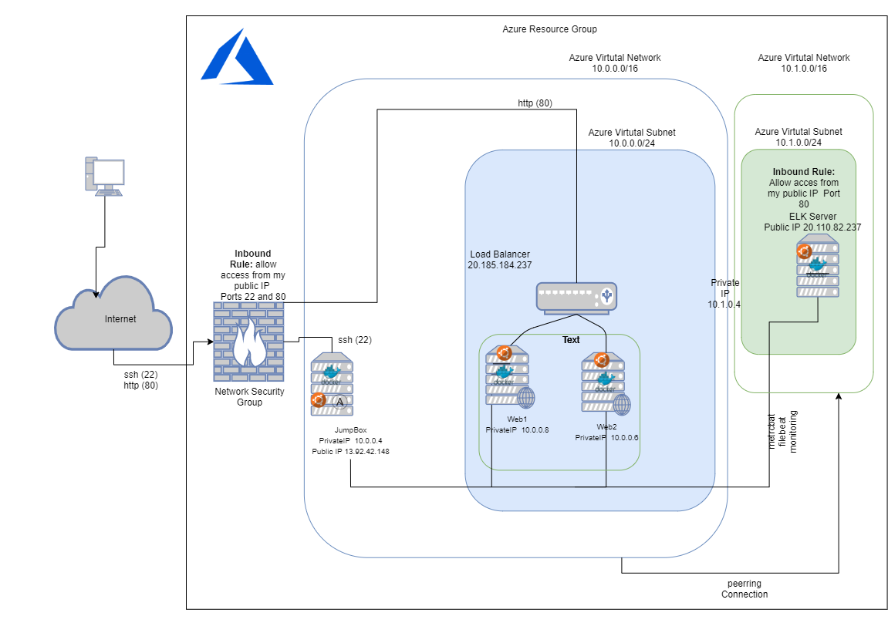

## Automated ELK Stack Deployment

The files in this repository were used to configure the network depicted below.

These files have been tested and used to generate a live ELK deployment on Azure. They can be used to either recreate the entire deployment pictured above. Alternatively, select portions of the Ansible file may be used to install only certain pieces of it, such as Filebeat.

  [Elk YAML file](../Ansible/Install-ELK.yml)

This document contains the following details:
- Description of the Topology
- Access Policies
- ELK Configuration
  - Beats in Use
  - Machines Being Monitored
- How to Use the Ansible Build

### Description of the Topology

The main purpose of this network is to expose a load-balanced and monitored instance of DVWA, the D*mn Vulnerable Web Application.

- What aspect of security do load balancers protect? the availability.  What is the advantage of a jump box?It provides another layer to the DiD model, since only people with access to that machine can reach the internal ones. having it also helps to keep control of security policies and updates.

Integrating an ELK server allows users to easily monitor the vulnerable VMs for changes to the file system and system metrics.
- What does Filebeat watch for? collects data about the file system
- What does Metricbeat record? collects machine metrics, such as uptime.

The configuration details of each machine may be found below.

| Name          | Private IP | Public IP      | Role             | OS    |
|---------------|------------|----------------|------------------|-------|
| Web-1         | 10.0.0.6   | ---------      | Web Server DVWA1 | Linux |
| Web-2         | 10.0.0.8   | ---------      | Web Server DVWA2 | Linux |
| JumpBox       | 10.0.0.4   | 13.92.42.148   | Gateway          | Linux |
| ELK           | 10.1.0.4   | 20.110.82.23   | ELK Monitor      | Linux |
| Load Balancer | ---------  | 20.185.184.237 | Load Balancer    | Linux |

### Access Policies

The machines on the internal network are not exposed to the public Internet. 

Only the Jump Box machine can accept connections from the Internet. Access to this machine is only allowed from the following IP addresses:
- My public IP Adress 4.31.XXX.XXX

Machines within the network can only be accessed by Jump Box.
- Which machine did you allow to access your ELK VM? What was its IP address?the jumpbox 10.0.0.4

A summary of the access policies in place can be found in the table below.

| Name       | Publicly available | allowed IP Address                           |
|------------|--------------------|----------------------------------------------|
| Web-1      | NO                 | 4.31.XXX.XXX and 10.0.0.4                    |
| Web-2      | NO                 | 4.31.XXX.XXX and 10.0.0.4                    |
| JumpBox    | NO                 | 4.31.XXX.XXX                                 |
| ELK        | NO                 | 4.31.XXX.XXX, 10.0.0.4 10.0.0.6 and 10.0.0.8 |
| Filebeat   | NO                 | 4.31.XXX.XXX,10.0.0.4 and 10.1.0.4           |
| Metricbeat | NO                 | 4.31.XXX.XXX,10.0.0.4 and 10.1.0.4           |
### Elk Configuration

Ansible was used to automate configuration of the ELK machine. No configuration was performed manually, which is advantageous because avoid human errors, makes repeatable infraestructure and is faster than a manual deployment.

The playbook implements the following tasks:
- Installs the docker.io package using apt.
- Install python3-pip package using apt.
- Install Docker module using pip
- download and launch a docker elk container and set ports
- Enable service on booting time

The following screenshot displays the result of running `docker ps` after successfully configuring the ELK instance.

### Target Machines & Beats
This ELK server is configured to monitor the following machines:
- 10.0.0.8 and 10.0.0.6

We have installed the following Beats on these machines:
- filebeat and metricbeat

These Beats allow us to collect the following information from each machine:
- Filebeat:collects data about the file system
    - “/var/log/apache2/*”
    - “/var/log/nginx/*”
    - “/var/log/mysql/*”
-  Metricbeat: collects machine metrics such as:
    - uptime
    - cpu
    - load
    - memory
    - network
    - process

### Using the Playbook
In order to use the playbook, you will need to have an Ansible control node already configured. Assuming you have such a control node provisioned: 

SSH into the control node and follow the steps below:
- Copy the playbook install-ELK.yml file to your ansible container root@5b6e87b2fa76:/etc/ansible#
- Update the /etc/ansible/hosts file to include elk 10.1.0.4 ansible_python_interpreter=/usr/bin/python3 to especify where to install ELK, different from filebeat that needs a Configuration File

_As a **Bonus**, provide the specific commands the user will need to run to download the playbook, update the files, etc._

- for updating a file you can use vi,vim,nano or other editor you prefer,

- for runnin a playbook ansible-playbook NameOfPlaybook.yml

- curl can be used for testing

- curl -o to download the dpkg